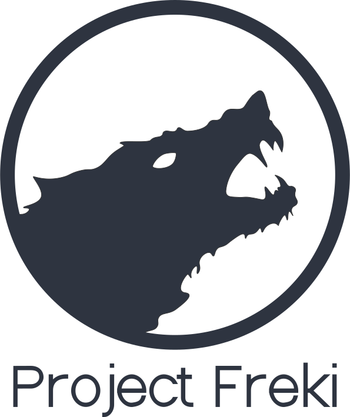

    

    
    

# Project Freki

Freki is a free and open-source malware analysis platform.

## Goals

1. Facilitate malware analysis and reverse engineering;
2. Provide an easy-to-use REST API for different projects;
3. Easy deployment (via Docker);
4. Allow the addition of new features by the community.

## Current features

- Hash extraction.
- VirusTotal API queries.
- Static analysis of PE files (headers, sections, imports, capabilities, and strings).
- Pattern matching with Yara.
- Web interface and REST API.
- User management.
- Community comments.
- Download samples.

Check our [wiki](https://github.com/crhenr/freki/wiki) for more details.

Open an [issue](https://github.com/crhenr/freki/issues) to suggest new features. All contributions are welcome.

## How to get the source code
`git clone https://github.com/crhenr/freki.git`

## Demo

Video demo: [https://youtu.be/AW4afoaogt0](https://youtu.be/AW4afoaogt0).

## Running

#### The easy way: Docker
1. Install [Docker](https://docs.docker.com/get-docker/) and [Docker Compose](https://docs.docker.com/compose/install/).
2. Edit the [.env](.env) file.
3. If you are going to use it in production, edit [freki.conf](nginx/freki.conf) to enable HTTPS.
4. Run `docker-compose up` or `make`.

#### Other ways
If you want to use it locally (e.g., for development), please check our [wiki](https://github.com/crhenr/freki/wiki) for more details.

## License

This project is licensed under the GNU Affero General Public License.
