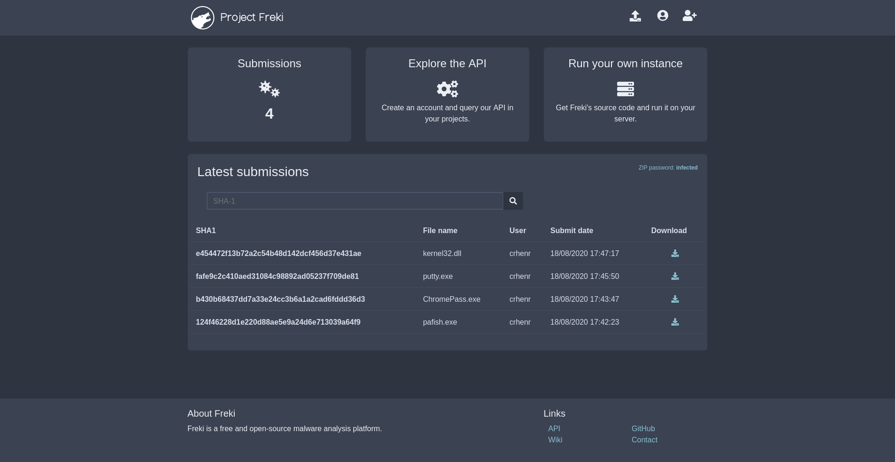
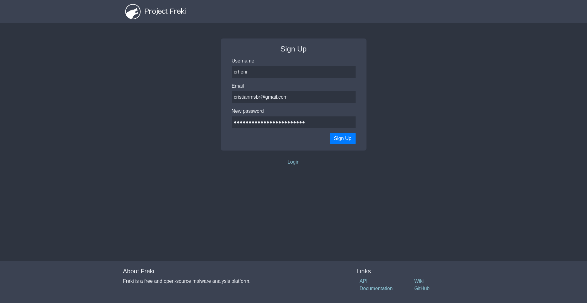
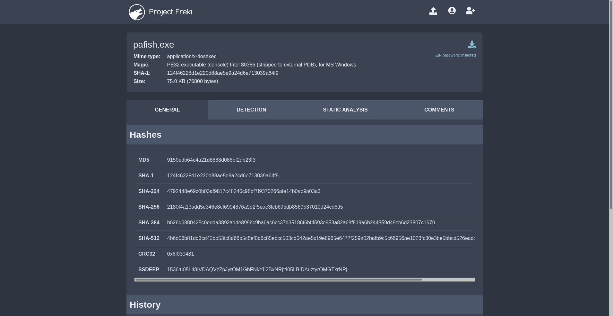
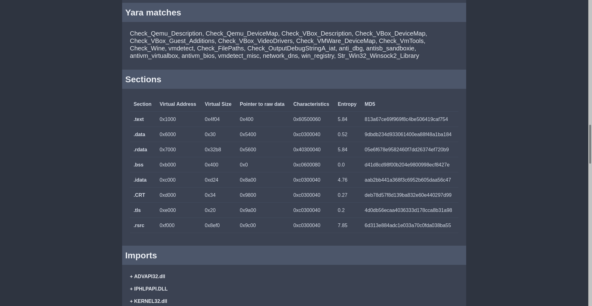
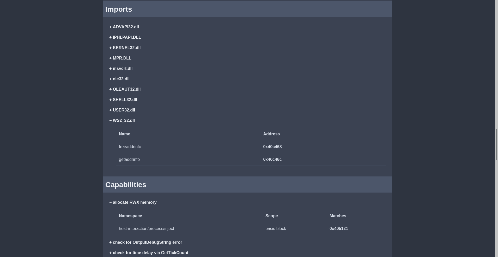

=============================
Overview and current features
=============================

What is Freki?
**************

Freki is a free and open-source malware analysis platform. It was built to facilitate malware analysis and reverse engineering.

It also provides a REST API, so you can query and use it in different projects.

Features
********

The current version supports the following features:

* Hash extraction
    * MD5, SHA-1, SHA-256, SHA-384, SHA-512, CRC32, and SSDEEP.
* VirusTotal API queries
    * AV results.
* Static analysis of PE samples
    * Headers, sections, imports, capabilities, and strings.
* Pattern matching with Yara
* User management
    * Account creation for sample submissions and API usage.
* Community comments
    * Users can comment and discuss about samples.
* Download samples
    * All samples are available for free.

Who can use it?
***************

Anyone who wants a malware analysis tool running locally or publicly. You can use it with a small group of friends or make your instance available to all world.

What is the difference to VirusTotal?
*************************************

Although VirusTotal and is a great tool for analyzing different files, it has some limitations. For example, you need to pay for downloading samples.

Another great tool is MalwareBazaar, since it fills some limitations of VirusTotal. However, you can not run it on your private machine or add new features.

It is worth noting that Freki is not a replacement of these tools (only if you want), but a collaborative alternative that was very inspired by them.

How can I have my own instance?
*******************************

Running Freki is very easy, you can do it via Docker or installing everything by hand. Please check the :doc:`administrator documentation <../admin/index>` for more details.

Technology
**********

Freki currently uses the following technology to get everything running:

* Front-end
    * `Bootstrap <https://getbootstrap.com/>`_: for easy and responsive interface development
* Back-end
    * `Python <https://www.python.org/>`_: main programming language
    * `Flask <https://flask.palletsprojects.com/en/1.1.x/>`_: lightweight web application framework
    * `SQLAlchemy <https://www.sqlalchemy.org/>`_: Python SQL toolkit
    * `Gunicorn <https://gunicorn.org/>`_: Python WSGI HTTP Server
    * `VirusTotal API <https://developers.virustotal.com/reference>`_: for querying the detection reports
    * `Yara <https://yara.readthedocs.io/en/stable/yarapython.html>`_: for pattern matching
    * `pefile <https://github.com/erocarrera/pefile>`_: to parse information about PE files
    * `capa <https://github.com/fireeye/capa>`_: to identify capabilities in PE files
* Infrastructure
    * `Docker <https://docs.docker.com/>`_: for easy deployment through containers
    * `Nginx <https://nginx.org/en/>`_: preferred web server
    * `MariaDB <https://mariadb.org/>`_: for storing information about samples

You can check all Python requirements `here <https://github.com/crhenr/freki/blob/master/freki/requirements.txt>`_.

Screenshots
***********

    Home page

    Sign up page

    Analysis page: General information

.. figure:: ../_static/screenshots/analysis_2.png
    :alt: Analysis

    Analysis page: VirusTotal detection

.. figure:: ../_static/screenshots/analysis_3.png
    :alt: Analysis

    Analysis page: Static analysis

    Analysis page: Static analysis

    Analysis page: Static analysis

.. figure:: ../_static/screenshots/analysis_6.png
    :alt: Analysis

    Community comments

.. figure:: ../_static/screenshots/profile.png
    :alt: Profile

    Profile page